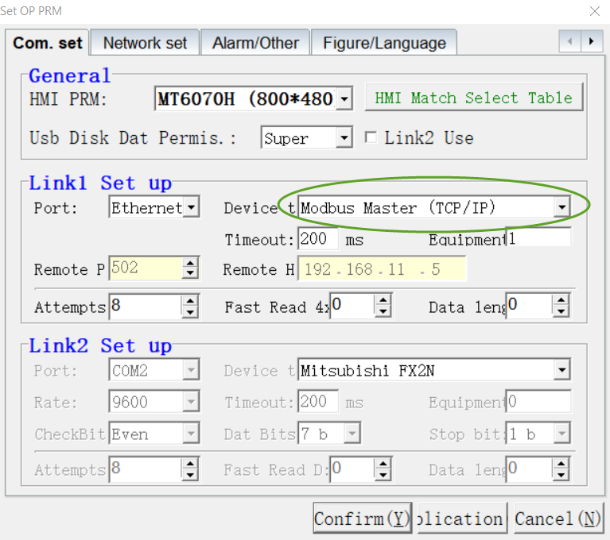
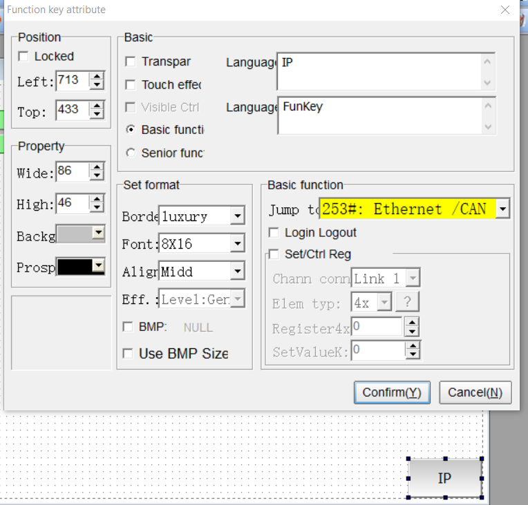

B1. Cài đặt modbus TCP Slaver trên Coolmay HMI
------------

B2. Tạo Function KEY HMI để thay đổi IP address.
------

**Vậy là chúng ta đã cài đặt ModbusTCP Slaver thành công và port mặc định là 502**

**Error**
--------
 
- Chú ý sau khi thay đổi, mỗi lần khởi động lại HMI cần khoảng 1phuts 30 s thì Ethernet trên HMI mới bắt đầu dùng được.

- Khi khởi động lại bằng phần mềm thì IP sẽ không hoạt động.

**Chú ý **
-------

- Test với Ethernet thì khi khời động lại HMI phải chờ khoảng 120s trở lên thì module ethernet trên HMI mới hoạt động.
